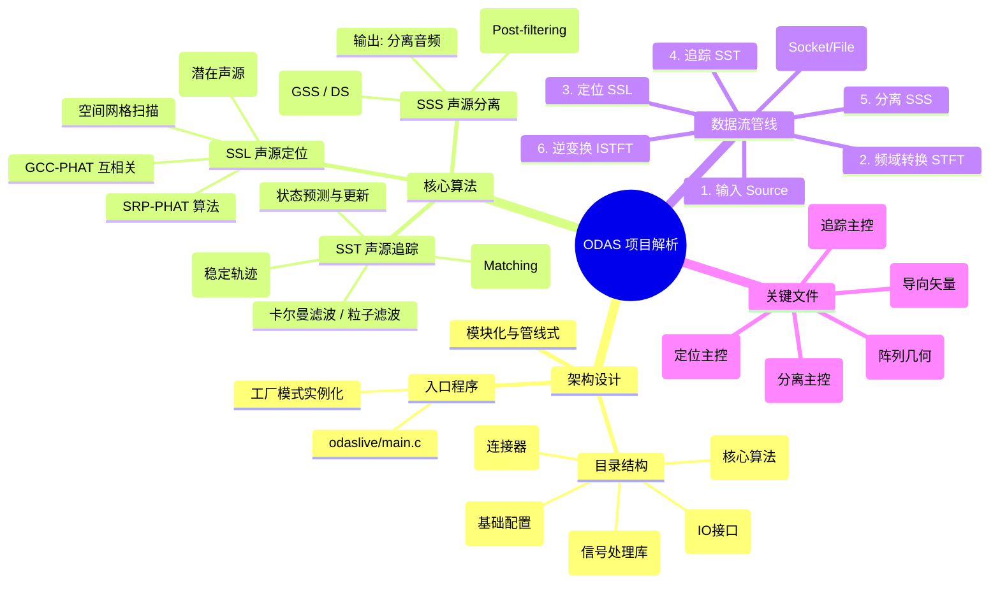

# ODAS
ODAS代码架构思维导图

```mermaid
mindmap
  root((ODAS 项目解析))
    架构设计
      模块化与管线式
      目录结构
        src/module (核心算法)
        src/signal (信号处理库)
        src/general (基础配置)
        src/connector (连接器)
        src/sink_source (IO接口)
      入口程序
        odaslive/main.c
        工厂模式实例化
    核心算法
      SSL 声源定位
        SRP-PHAT 算法
        GCC-PHAT 互相关
        空间网格扫描
        输出: POTs (潜在声源)
      SST 声源追踪
        卡尔曼滤波 / 粒子滤波
        数据关联 (Matching)
        状态预测与更新
        输出: Tracks (稳定轨迹)
      SSS 声源分离
        波束形成 (GSS / DS)
        后滤波 (Post-filtering)
        输出: 分离音频
    数据流管线
      1. 输入 Source
      2. 频域转换 STFT
      3. 定位 SSL
      4. 追踪 SST
      5. 分离 SSS
      6. 逆变换 ISTFT
      7. 输出 Sink (Socket/File)
    关键文件
      mod_ssl.c (定位主控)
      mod_sst.c (追踪主控)
      mod_sss.c (分离主控)
      steer.c (导向矢量)
      mic.c (阵列几何)
```
